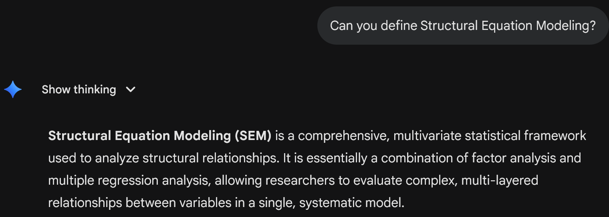

## Welcome! {background-iframe="https://app.sli.do/event/gVW2cjYXoUwMrGT55gy1Mr" background-interactive="true"}

```{r}
#| include: false
source(here::here("_setup.R"))
library(semPlot)
library(tinytable)
```

```{r}
#| include: false
knitr::read_chunk(here::here("notes", "R", "data-exploration.R"))
```

```{r}
#| include: false
library(countdown)
```

## What is SEM?



---


# Brief History

## Early History {.smaller}

::::: {.columns}

:::: {.column width="40%" .nonincremental}

::: {.fragment fragment-index=1}
- Biology/Genetics: Sewall Wright (1921) and path analysis
:::
::: {.fragment fragment-index=2}
- Psychology: Charles Spearman (1904) and the "g factor"
:::
::: {.fragment fragment-index=3}
- Economics: Ragnar Frisch, Trygve Haavelmo, and simultaneous equations
    * Also advances in error-in-variables models and and estimators.
:::
::::

:::: {.column width="60%"}
::: {.r-stack}
::: {.content-hidden unless-profile="present"}
{.fragment fragment-index=1}
:::

::: {.content-hidden unless-profile="present"}
{.fragment fragment-index=2}
:::

::: {.content-hidden unless-profile="present"}
{.fragment fragment-index=3}
:::
:::
::::

:::::

## Modern-Day SEM

- Sociology: Otis Duncan (1966) and Peter Blau & Duncan (1967) on status attainment and path analysis
- Psychology & Education: Jöreskog (1969) and CFA and LISREL program

<!-- John Nesselroade (2007, p. 252), "indicators are our worldly window into the latent space." -->

. . .

### Some other names

- Covariance structure analysis
- Latent variable modeling
- Structural causal modeling

## Example Data {.smaller}

- **Data source**: Williams & Edwards ([2021](https://cipp.ug.edu.pl/Conceptual-replication-of-Seo-2008-Self-efficacy-as-a-mediator-in-the-relationship,142208,0,2.html), conceptual replication of Seo, 2008)
    - `SOP`: Self-Oriented Perfectionism (5 items)
    - `NGSE`: General Self-Efficacy (8 items)
    - `PASS`: Academic Procrastination (4 indicators)
- Final model: <https://www.ncbi.nlm.nih.gov/core/lw/2.0/html/tileshop_pmc/tileshop_pmc_inline.html?title=Click%20on%20image%20to%20zoom&p=PMC3&id=10535626_CIPP-10-142208-g001.jpg>

# Regression to Path Analysis

## Regression

```{r}
#| label: load-data
#| include: false
```

```{r}
#| label: we-parcels
#| include: false
```

```{r}
# Sum scores
we_data$PASS <- rowMeans(we_data[, c("Pasgn", "Pexam", "Pread", "Pgen")])
we_data$NGSE <- rowMeans(we_data[, c("NGSE_1", "NGSE_2", "NGSE_3", "NGSE_4", "NGSE_5", "NGSE_6", "NGSE_7", "NGSE_8")])
we_data$SOP <- rowMeans(we_data[, c("SOP_1", "SOP_2", "SOP_3", "SOP_4", "SOP_5")])
```

$$
Y = \beta_0 + \beta_1 X + e
$$

```{r}
#| fig-align: center
ggplot(we_data[1:10, ], aes(x = SOP, y = NGSE)) +
    geom_point(size = 2) +
    labs(
        x = "SOP (Self-Oriented Perfectionism)",
        y = "NGSE (General Self-Efficacy)"
    ) + theme_bw() +
    theme(panel.grid = element_blank())
```

## Regression and Covariance {.smaller}

The linear model implies that

$$
\text{Cov}(Y, X) = \beta_1 \text{Var}(X)
$$

So we can write the **covariance matrix** of the observed variables as functions of the regression **parameters**

$$
\begin{aligned}
\boldsymbol{\Sigma} & = \begin{bmatrix}
\text{Var}(X) &  \\
\text{Cov}(Y, X) & \text{Var}(Y)
\end{bmatrix} \\
& =
\begin{bmatrix}
\text{Var}(X) &  \\
\beta_1 \text{Var}(X) & \beta_1^2 \text{Var}(X) + \text{Var}(e)
\end{bmatrix} =
\begin{bmatrix}
\psi_{11} & \\
\beta_1 \psi_{11} & \beta_1^2 \psi_{11} + \psi_{22}
\end{bmatrix}
\end{aligned}
$$

. . .

In other words, we can estimate the model parameters

$\beta_1$, $\psi_{11}$, and $\psi_{22}$

using the covariance matrix as input.

## {visibility="hidden"}

### Running regression with SEM (*lavaan*)

```{r}
library(lavaan)
library(modelsummary)
```

```{r}
cat("Input covariance matrix: Σ\n")
cov(we_data[, c("SOP", "NGSE")]) |> round(2)
```

. . .

```{r}
#| echo: true
# Fitting model with lavaan
model <- "
    NGSE ~ b1 * SOP
"
reg1 <- sem(model, data = we_data)
parameterEstimates(reg1)
```

. . .

```{r}
#| echo: true
# Implied-covariance from the regression parameters
reg1@implied$cov[[1]] |> round(2)
```

## {.smaller}

:::: {.columns}

::: {.column width="38%"}

Input covariance matrix:

```{r}
cbind(
    ` ` = c("SOP", "NGSE"),
    cov(we_data[, c("SOP", "NGSE")]) |>
        as.data.frame() |>
        round(2)
) |>
    tt()
```

:::

::: {.column width="3%"}

:::

::: {.column width="59%"}

Estimate: $\psi_{11}$ = 0.99, $\psi_{22}$ = 0.46, $\beta_1$ = 0.14

$$
\begin{aligned}
& \quad \ \begin{bmatrix}
\psi_{11} & \\
\beta_1 \psi_{11} & \beta_1^2 \psi_{11} + \psi_{22}
\end{bmatrix} \\
& =
\begin{bmatrix}
0.99 & \\
0.14 \times 0.99 & 0.14^2 \times 0.99 + 0.46
\end{bmatrix} \\
& =
\begin{bmatrix}
0.99 & \\
0.14 & 0.48
\end{bmatrix}
\end{aligned} 
$$

:::

::::

## Path Diagram

```{r}
#| echo: false
#| fig-width: 4.5
#| fig-height: 3.2
# nodes order: [NGSE, SOP]  (endo first, then exo)
ly1 <- matrix(c(1, -1,   # x: SOP=-1, NGSE=1
                 0, 0),  # y: both at 0
              nrow = 2)
semPaths(reg1, what = "path", whatLabels = "est",
         residuals = TRUE, nCharNodes = 0,
         sizeMan = 12, edge.width = 1.5,
         edge.label.cex = 1.4,
         layout = ly1)
```

```{r}
#| include: false
pe1 <- parameterEstimates(reg1)
```

. . .

::: {.callout-note}

## Interpretation

One unit difference in SOP is associated with a difference of `r round(pe1[pe1$lhs == "NGSE" & pe1$rhs == "SOP", "est"], 2)` in NGSE, *SE* = `r round(pe1[pe1$lhs == "NGSE" & pe1$rhs == "SOP", "se"], 2)`, *p* `r ifelse(pe1[pe1$lhs == "NGSE" & pe1$rhs == "SOP", "pvalue"] < 0.001, "< 0.001", paste0("= ", round(pe1[pe1$lhs == "NGSE" & pe1$rhs == "SOP", "pvalue"], 2)))`.

:::

## Path Analysis---More Y Variables

```{r}
#| echo: false
#| fig-width: 6.5
#| fig-height: 3.5
path_mod <- "
    NGSE ~ b1*SOP
    PASS ~ b2*NGSE + b3*SOP
"
# nodes order: [NGSE, PASS, SOP]  (endos first, then exo)
# ggdag: SOP(0,0), NGSE(1,1), PASS(2,0)  -> normalised: SOP(-1,-1), NGSE(0,1), PASS(1,-1)
ly2 <- matrix(c(0,  1, -1,   # x
                1, -1, -1),  # y
              nrow = 3)
p_path <- semPaths(
    lavaanify(path_mod), what = "path",
    residuals = FALSE, nCharNodes = 0,
    sizeMan = 12, edge.width = 1.5,
    edge.label.cex = 1.4,
    layout = ly2)
```

## Simultaneous/Structural Equations

Two equations:

$$
\begin{aligned}
\text{NGSE} & = \beta_1 \text{SOP} + e_1 \\
\text{PASS} & = \beta_2 \text{NGSE} + \beta_3 \text{SOP} + e_2
\end{aligned}
$$

```{r}
#| fig-width: 4.5
#| fig-height: 3.2
#| layout-ncol: 2
# nodes order: [PASS, NGSE, SOP]
# ggdag: SOP(-1,-1), NGSE(0,1), PASS(1,-1)
ly_b <- matrix(c(1,  0, -1,   # x
                -1,  1, -1),  # y
               nrow = 3)
ly_a <- ly_b[2:3, ]

semPaths(reg1, what = "path", whatLabels = "hide",
         residuals = FALSE, nCharNodes = 0,
         sizeMan = 12, edge.width = 1.5,
         edge.label.cex = 1.4,
         layout = ly_a)

mod_b <- "PASS ~ NGSE + SOP"
# nodes order: [PASS, NGSE, SOP]
# ggdag: SOP(-1,-1), NGSE(0,1), PASS(1,-1)
ly_b <- matrix(c(1,  0, -1,   # x
                -1,  1, -1),  # y
               nrow = 3)
semPaths(lavaanify(mod_b), what = "path", whatLabels = "hide",
         residuals = FALSE, nCharNodes = 0,
         sizeMan = 12, exoCov = FALSE, layout = ly_b)
```

## Simultaneous/Structural Equations (cont'd) {visibility="hidden"}

- One can estimate $\beta_1$, $\beta_2$, $\beta_3$ using two separate regressions.
- Or one can estimate them simultaneously using one SEM model.

## Path Tracing {.smaller}

:::: {.columns}

::: {.column width="50%"}

```{r}
#| fig-width: 6.5
#| fig-height: 3.2
plot(p_path)
```

$$
\begin{aligned}
\boldsymbol{\Sigma} & = \begin{bmatrix}
a & & \\
b & c & \\
d & e & f
\end{bmatrix}
\end{aligned}
$$

:::

::: {.column width="50%"}

$$
\begin{aligned}
a & = \text{Var}(\text{SOP}) = \psi_{11} \\
b & = \text{Cov}(\text{NGSE}, \text{SOP}) = \beta_1 \psi_{11} \\
c & = \text{Var}(\text{NGSE}) = \beta_1^2 \psi_{11} + \psi_{22} \\
d & = \text{Cov}(\text{PASS}, \text{SOP}) = \beta_2 \beta_1 \psi_{11} + \beta_3 \psi_{11} \\
e & = \text{Cov}(\text{PASS}, \text{NGSE}) \\
  & = \beta_2 (\beta_1^2 \psi_{11} + \psi_{22}) + \beta_3 \beta_1 \psi_{11} \\
f & = \text{Var}(\text{PASS}) \\
  & = \beta_2^2 (\beta_1^2 \psi_{11} + \psi_{22}) + 2 \beta_2 \beta_3 \beta_1 \psi_{11} + \beta_3^2 \psi_{11} + \psi_{33}
\end{aligned}
$$

:::

::::

## Matrix

$$
\begin{bmatrix}
\text{SOP} \\
\text{NGSE} \\
\text{PASS}
\end{bmatrix} =
\begin{bmatrix}
\alpha_1 \\
\alpha_2 \\
\alpha_3
\end{bmatrix} +
\begin{bmatrix}
0 & 0 & 0 \\
\beta_1 & 0 & 0 \\
\beta_3 & \beta_2 & 0
\end{bmatrix}
\begin{bmatrix}
\text{SOP} \\
\text{NGSE} \\
\text{PASS}
\end{bmatrix} +
\begin{bmatrix}
e_1 \\
e_2 \\
e_3
\end{bmatrix}
$$

$$
\boldsymbol{\eta} = \boldsymbol{\alpha} + \mathbf{B} \boldsymbol{\eta} + \boldsymbol{\zeta}
$$

# Steps of Path Analysis

## Adapted from Bollen (1989; 2026)

1. Model specification
2. Model identification
3. Model estimation
4. Test and evaluation
5. (Model modification/respecification)

## 1. Model Specification

- Translate substantive knowledge/theory into path diagram(s)
- Arrows in the diagram represent causal relationships
    * Directed arrow (→): weak assumption (path can be zero or nonzero)
    * Absence of arrow: *strong* assumption (path is zero)

## 2. Model Identification {.smaller}

> Can we uniquely determine model parameters from data?

- Basic SEM is about covariance structure
    * Target: explain each element of the covariance matrix by some number of parameters

:::: {.columns}

::: {.column width="40%"}

- Number of unique elements: $p^* = p(p+1)/2$ for $p$ observed variables

:::

::: {.column width="60%" .fragment}

```{r}
mat <- matrix(c("1", "", "",
                "2", "3", "",
                "4", "5", "6"),
              nrow = 3, byrow = TRUE,
              dimnames = list(c("SOP", "NGSE", "PASS"),
                              c("SOP", "NGSE", "PASS")))
as.data.frame(cbind(" " = c("SOP", "NGSE", "PASS"), mat)) |>
  tt(rownames = FALSE, width = 0.6) |>
  theme_grid() |>
  style_tt(
    j = 1:4,
    align = "c"
  ) |>
  style_tt(i = 1, j = 2, background = "salmon") |>
  style_tt(i = 2, j = 2:3, background = "salmon") |>
  style_tt(i = 3, j = 2:4, background = "salmon")
```

:::

::::

---

- Let $t$ = number of *free* parameters in the model
    * Underidentified: $t > p^*$
    * Just-identified: $t = p^*$ (also called "saturated")
    * Overidentified: $t < p^*$
- $p^* - t$ = degrees of freedom (df) for model test

---

There are other requirements for identification, including

- Scaling of latent variables
- Measurement model identification
- Recursive vs. non-recursive models
- Empirical identification (e.g., no perfect multicollinearity, no Heywood cases)

. . .

See Kline (2023) for details.

## 3. Model Estimation

Estimate the model parameters, such as $\beta$ (path coefficient), $\psi$ (variances/covariances)

```{r}
#| label: reg2
#| echo: false
# Note: the labels b1, b2, b3 are optional.
model2 <- "
    NGSE ~ b1 * SOP
    PASS ~ b2 * NGSE + b3 * SOP
"
reg2 <- sem(model2, data = we_data)
```

```{r}
#| echo: false
parameterEstimates(reg2) |> tt(digits = 2)
```

## Common Estimators {.smaller}

+------+--------------------------------------------------------------------------------------+
| ML   | Maximum Likelihood                                                                   |
+------+--------------------------------------------------------------------------------------+
| MLR  | Maximum Likelihood, Robust (Huber–White Sandwich SE; Yuan–Bentler Scaled Test Statistic) |
+------+--------------------------------------------------------------------------------------+

: Maximum Likelihood (ML) family

. . .

+------+--------------------------------------------------------------+
| ULS  | Unweighted Least Squares                                     |
+------+--------------------------------------------------------------+
| WLS  | Weighted Least Squares                                       |
+------+--------------------------------------------------------------+
| DWLS | Diagonally Weighted Least Squares                            |
+------+--------------------------------------------------------------+
| WLSMV| Weighted Least Squares, Robust Mean–Variance Adjusted        |
+------+--------------------------------------------------------------+

: Least Squares (LS) family

. . .

See [documentation of *lavaan*](https://lavaan.ugent.be/tutorial/est.html). Other estimators include two-stage least squares (2SLS), Bayesian estimation, etc.

## 4. Testing and Evaluation (Where SEM Shines)

:::: {.columns}

::: {.column width="55%"}

- Test of individual parameters
    * Wald test (z-test): $\hat{\theta} / SE(\hat{\theta})$
    * Likelihood ratio test (LRT)
- Test of multiple parameters
    * LRT comparing nested models

:::

::: {.column width="45%"}

- Overall model fit (most meaningful for measurement models)
    * Global $\chi^2$ test
    * Approximate fit indices (CFI, RMSEA, SRMR, etc.)

:::

::::

# Using the *lavaan* Package

## Data Exploration

```{r}
#| fig-align: center
#| echo: true
library(psych)
pairs.panels(we_data[, c("SOP", "NGSE", "PASS")],
             smooth = TRUE, method = "pearson",
             hist.col = "steelblue", ellipses = FALSE)
```

## Model Specification

```{r}
#| label: reg2
#| echo: true
```

. . .

::: {.callout-note .nonincremental}

## *lavaan* operators

- `NGSE ~ SOP` means "NGSE caused by SOP" ($\beta_1$)
- `SOP ~~ SOP` means "SOP covaries with itself" (variance $\psi_{11}$)
- `NGSE ~~ NGSE` means "NGSE covaries with itself" (error variance $\psi_{22}$)

:::

. . .

::: {.callout-note .nonincremental}

## Exogeneous vs. Endogeneous Variables

- `SOP` is exogenous (no arrows pointing to it); $\psi_{11}$ is its variance
- `NGSE` is endogenous (has arrows pointing to it); $\psi_{22}$ is **error** variance

:::

## Model Identification

- Unique elements in covariance matrix: $p^* = 3 (3 + 1) / 2 = 6$
- Free parameters:
    * 3 path coefficients: $\beta_1$, $\beta_2$, $\beta_3$
    * 3 variances: $\psi_{11}$, $\psi_{22}$, $\psi_{33}$
- Just-identified: $t = p^* = 6$ (*df* = 0)
    * The parameters can perfectly reproduce $\Sigma$

---

```r
reg2
```

```{r}
#| results: asis
cat("```{.default code-line-numbers='3|13'}\n")
print(reg2)
cat("```")
```

## Estimation

```{r}
#| echo: true
parameterEstimates(reg2, standardized = "std.all")
```

Standardized coefficients: change in *SD* of *Y* per 1 *SD* change in *X*

```{r}
#| include: false
pe2 <- parameterEstimates(reg2, standardized = "std.all")
```

E.g., One *SD* difference in general self-efficacy corresponds to a `r round(pe2[pe2$lhs == "PASS" & pe2$rhs == "NGSE", "std.all"], 2)` *SD* difference in academic procrastination, *SE* = `r round(pe2[pe2$lhs == "PASS" & pe2$rhs == "NGSE", "se"], 2)`, *p* `r ifelse(pe2[pe2$lhs == "PASS" & pe2$rhs == "NGSE", "pvalue"] < 0.001, "< 0.001", paste0("= ", round(pe2[pe2$lhs == "PASS" & pe2$rhs == "NGSE", "pvalue"], 2)))`.

## Path Diagram

```{r}
#| echo: true
# You can use the `semPlot` package to put parameter estimates 
# on the path diagram.
library(semPlot)
semPaths(reg2, whatLabels = "std", layout = "tree", edge.label.cex = 1.2,
         sizeMan = 6, nCharNodes = 0)
```

## Reporting Sample

> We used the R package *lavaan* to test the indirect effect of SOP on PASS through NGSE, with maximum likelihood estimation. Figure X shows the path diagram with standardized coefficients ($\beta$). We found a significant and negative indirect effect of Self-Oriented Perfectionism on Academic Procrastination through General Self-Efficacy, as indicated by the significant positive path from SOP to NGSE, $\beta_1$ = `r round(pe2[pe2$lhs == "NGSE" & pe2$rhs == "SOP", "std.all"], 2)`, *SE* = `r round(pe2[pe2$lhs == "NGSE" & pe2$rhs == "SOP", "se"], 2)`, *p* `r ifelse(pe2[pe2$lhs == "NGSE" & pe2$rhs == "SOP", "pvalue"] < 0.001, "< 0.001", paste0("= ", round(pe2[pe2$lhs == "NGSE" & pe2$rhs == "SOP", "pvalue"], 2)))`, and the significant negative path from NGSE to PASS $\beta_2$ = `r round(pe2[pe2$lhs == "PASS" & pe2$rhs == "NGSE", "std.all"], 2)`, *SE* = `r round(pe2[pe2$lhs == "PASS" & pe2$rhs == "NGSE", "se"], 2)`, *p* `r ifelse(pe2[pe2$lhs == "PASS" & pe2$rhs == "NGSE", "pvalue"] < 0.001, "< 0.001", paste0("= ", round(pe2[pe2$lhs == "PASS" & pe2$rhs == "NGSE", "pvalue"], 2)))`.

## Testing

- Beyond individual parameters, one can test
    * Whether multiple parameters are all zero
    * Whether two coefficients are equal (e.g., $\beta_2$ vs. $\beta_3$)

---

### Example: Test $H_0$: $\beta_1$ = $\beta_3$

```{r}
#| label: reg3
#| echo: true
#| results: false
#| output-location: fragment
model3 <- "
    NGSE ~ b1 * SOP
    PASS ~ b2 * NGSE + b3 * SOP
    # Constrain b1 and b3 to be equal
    b1 == b3
"
reg3 <- sem(model3, data = we_data)
parameterEstimates(reg3, standardized = "std.all")
```

```{r}
#| results: asis
cat("```{.default code-line-numbers='2,4'}\n")
parameterEstimates(reg3, standardized = "std.all")
cat("```")
```

---

### Example: Test $H_0$: $\beta_1$ = $\beta_3$ (cont'd)

Likelihood ratio test: not significant, not rejecting $H_0$

::: {.fragment}
=> Insufficient evidence that we need different parameters for $\beta_1$ and $\beta_3$
:::

::: {.fragment}
=> $\beta_1$ and $\beta_3$ are not significantly different from each other.
:::

::: {.fragment}

```{r}
#| echo: true
anova(reg2, reg3)
```

:::

## Exercise {background-color='' .smaller}

::: {.nonincremental}
1. Run the R code in "note/data-exploration.R" to explore the data.
2. Fit the full path model using `we_data`:
   
   ```r
   model2 <- "
       NGSE ~ b1 * SOP
       PASS ~ b2 * NGSE + b3 * SOP
   "
   reg2 <- sem(model2, data = we_data)
   ```

3. Fit a restricted path model where the direct effect of `SOP` on `PASS` is removed:
   
   ```r
   model_restricted <- "
       NGSE ~ b1 * SOP
       PASS ~ b2 * NGSE
   "
   reg_restricted <- sem(model_restricted, data = we_data)
   ```
    
    What is the *p*-value from the likelihood ratio test comparing the two models, using the code below?
       
    ```r
    anova(reg2, reg_restricted)
    ```
:::

When you finish, go to next page and answer the question in the Slido poll!

`r countdown(minutes = 10)`

##

Switch Slido to # 1974000

<iframe src="https://app.sli.do/event/4yTrQWkJQSZ9CqXeecr8ap" height="100%" width="100%" frameBorder="0" style="min-height: 560px;" allow="clipboard-write" title="Slido"></iframe>